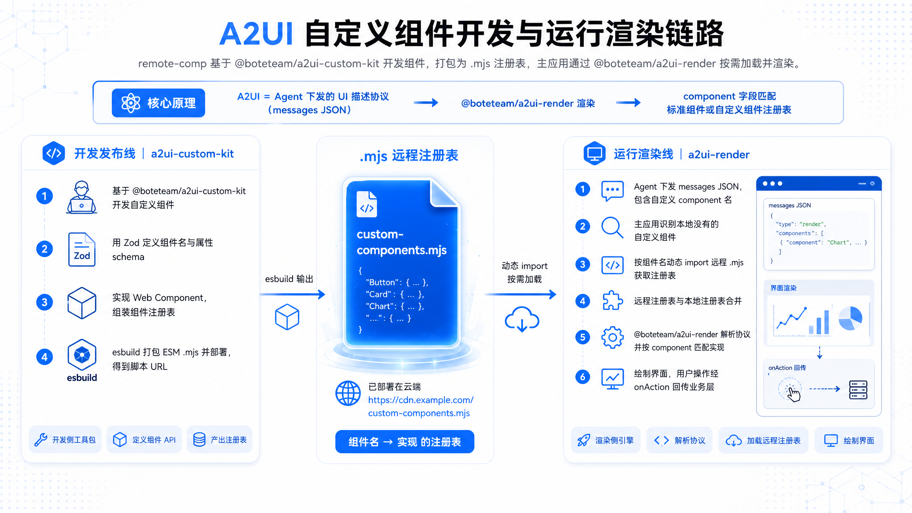
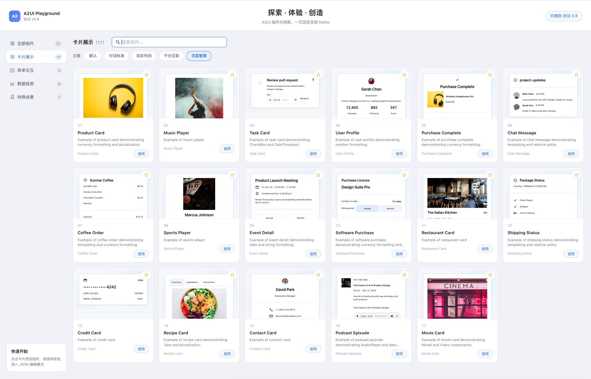

# Bote A2UI

**面向 Web 的 [A2UI](https://github.com/google/A2UI) 协议 React 渲染 SDK — 将 LLM 生成的 UI 消息实时渲染为可交互界面，内置主题切换、自定义组件扩展与在线 Playground。**

[English](./README.md) | 中文 · **仓库**：[github.com/BoteAI/a2ui](https://github.com/BoteAI/a2ui)

> 项目持续迭代中，`@boteai/a2ui-render`、`@boteai/a2ui-custom-kit` 与 `@boteai/a2ui-comp-preset` 正准备开源发布，欢迎反馈与贡献。

---

## 体验 Playground

无需接入 Agent，即可浏览 30+ 组件示例、切换主题、在线编辑 JSON。

**环境要求**：Node.js 16+、Yarn 1.x

```bash
git clone https://github.com/BoteAI/a2ui.git
cd a2ui

yarn bs          # 安装 workspace 依赖
yarn build       # 构建 packages（首次或包代码变更后）
yarn start       # 启动 Playground 开发服务
```

浏览器访问：

| 页面 | 地址 |
|------|------|
| **Playground v0.9**（默认） | [http://localhost:8000/#/a2ui-playgroup/v9](http://localhost:8000/#/a2ui-playgroup/v9) |
| Playground v0.8 | [http://localhost:8000/#/a2ui-playgroup/v8](http://localhost:8000/#/a2ui-playgroup/v8) |
| 自定义组件开发指南 | [http://localhost:8000/#/a2ui-playgroup/v9/custom-components-guide](http://localhost:8000/#/a2ui-playgroup/v9/custom-components-guide) |

也可进入 `app` 目录执行 `yarn dev`，效果与根目录 `yarn start` 相同。

开发 packages 时，可在另一个终端运行 `yarn watch`，监听 `@boteai/a2ui-render`、`@boteai/a2ui-custom-kit` 与 `@boteai/a2ui-comp-preset` 的变更。

---

## 解决什么问题？

当 AI Agent 或后端下发 **A2UI 协议消息**（描述界面结构、数据绑定与交互动作的 JSON）时，前端需要一套 **客户端渲染器** 来完成：

1. 解析流式或批量的协议消息
2. 渲染标准 A2UI 组件（Text、Button、Card、List 等）
3. 统一的主题与样式体系
4. 通过 `onAction` 将用户操作回传给业务层
5. 当协议中出现 **自定义组件名** 时，扩展组件目录并完成匹配渲染

**Bote A2UI** 是面向 **Web / React** 场景的完整方案，专注于 **浏览器端 Agent UI**、对话气泡、管理后台与微前端等场景。

```
Agent / 后端
      │  A2UI messages JSON
      ▼
@boteai/a2ui-render          ← 协议渲染引擎（React + Lit 表面）
      │  customComponents 注册表
      ├──────────────────────────────────┐
      ▼                                  ▼
@boteai/a2ui-comp-preset       @boteai/a2ui-custom-kit
（内置 Preset 组件集）         （自定义组件定义、注册与打包工具）
      │                                  │
      └──────────────┬───────────────────┘
                     ▼
        业务自定义组件（本地 bundle 或远程 .mjs）
```

---

## 包结构

| 包 | npm | 职责 |
|----|-----|------|
| **a2ui-render** | `@boteai/a2ui-render` | A2UI v0.8 / v0.9 协议渲染引擎 |
| **a2ui-custom-kit** | `@boteai/a2ui-custom-kit` | 自定义组件开发工具集 |
| **a2ui-comp-preset** | `@boteai/a2ui-comp-preset` | 内置 Preset 组件注册表与 JSON Schema |

本仓库 `app/` 目录还包含 **Playground 试玩应用**，用于浏览示例、编辑 JSON、验证自定义组件，不发布到 npm。

---

## 核心亮点

### 1. A2UI 协议渲染引擎

`BaseRenderer` 接收 A2UI 消息数组，渲染完整可交互界面。支持 **v0.8 / v0.9 双协议**、消息版本自动推断、响应式工具与声明式 action 回调。

```tsx
import { BaseRenderer, type A2UIMessage } from '@boteai/a2ui-render';

<BaseRenderer
  messages={messages}
  protocolVersion="0.9"
  themePreset="deepBlueWisdom"
  onAction={({ name, context }) => {
    // 处理按钮点击、表单提交等交互
  }}
/>
```

### 2. 内置主题 — 一行切换

内置 **4 套精选视觉主题**（另含 default 基础主题），通过 CSS 变量覆盖与 Shadow DOM 样式表实现。运行时只需传入 `themePreset`，无需重新构建。

| 预设名 | 说明 |
|--------|------|
| `default` | A2UI Lit 默认 token |
| `conversation` | 对话场景，圆角控件与舒适间距 |
| `cyber` | 炫彩科技风 |
| `platformInterconnect` | 平台互联企业风 |
| `deepBlueWisdom` | 深蓝智慧仪表盘风 |

完整变量列表见 [`packages/a2ui-render/styleVars.md`](./packages/a2ui-render/styleVars.md)。

### 3. 自定义组件 — 两种集成方式

协议消息中出现 **业务自定义组件名** 时，通过 `@boteai/a2ui-custom-kit` 注册实现：

| 方式 | 适用场景 | 产出物 |
|------|----------|--------|
| **本地注册表** | 组件与渲染器在同一应用中 | `customComponents` 对象传给 `BaseRenderer` |
| **远程 ESM 包** | 独立团队开发、CDN 分发、微前端 | esbuild 打包的 `.mjs`，运行时 `loadRemoteA2UICustomRegistry` 加载 |

两种方式共享同一套注册表结构：Zod 定义 API → 原生 Web Component 或 React 桥接实现 → 合并注册表 → 交给渲染器。



**本地注册典型流程**

```ts
import {
  defineComponentApi,
  createReactComponent,
  defineRegistryEntry,
  mergeRegistryEntries,
} from '@boteai/a2ui-custom-kit';

const api = defineComponentApi({ name: 'MyCard', shape: { title: z.string() } });
const element = createReactComponent(({ title }) => <div>{title}</div>);
const registry = mergeRegistryEntries(defineRegistryEntry({ api, element }));
```

**远程 ESM 典型流程**

```ts
import { loadRemoteA2UICustomRegistry, mergeRegistryEntries } from '@boteai/a2ui-render';

const remote = await loadRemoteA2UICustomRegistry(
  'https://cdn.example.com/custom-components.mjs',
);
const customComponents = mergeRegistryEntries(localRegistry, remote);
```

> 详细指南：[`packages/a2ui-custom-kit/README.md`](./packages/a2ui-custom-kit/README.md) · [`app/public/docs/custom-components-guide.md`](./app/public/docs/custom-components-guide.md)

### 4. A2UI Playground

内置 **Playground** 让你无需先接入完整 Agent，即可浏览、预览与调试 A2UI 界面。



| 能力 | 说明 |
|------|------|
| **组件示例库** | v0.9 下 30+ 示例，覆盖卡片、表单、数据报表、特殊场景 |
| **协议切换** | 支持 A2UI v0.8 / v0.9 一键切换 |
| **主题预览** | 实时切换全部内置主题预设 |
| **JSON 编辑** | 在线编辑 messages，即时预览渲染效果 |
| **自定义组件指南** | 在示例库打开「自定义组件示例集」→「开发指南」，或阅读 [`app/public/docs/custom-components-guide.md`](./app/public/docs/custom-components-guide.md) |

本地启动方式见 [体验 Playground](#体验-playground)。

### 5. 内置 Preset 组件（`@boteai/a2ui-comp-preset`）

官方 A2UI catalog 覆盖核心布局与输入类组件。**`@boteai/a2ui-comp-preset`** 提供一批 **开箱即用的 Preset 组件** — 数据表格、图表、指标卡、仪表盘卡片等 — 让接入方无需从零实现常见 UI。

| 组件 | 说明 |
|------|------|
| `PresetTitle` | 区块 / 页面标题 |
| `PresetButton` | 样式化操作按钮 |
| `PresetBadge` | 状态 / 标签徽章 |
| `PresetSelect` | 下拉选择（antd） |
| `PresetRow` / `PresetColumn` | Flex 布局容器 |
| `PresetMetric` | KPI / 指标卡 |
| `PresetDashboardCard` | 仪表盘摘要卡 |
| `PresetDataTable` | 数据表格 |
| `PresetBarChart` / `PresetPieChart` | 图表（recharts） |
| `PresetFlightCard` | 航班状态卡（领域示例） |

将生成的注册表传给 `BaseRenderer.customComponents` 即可使用：

```tsx
import { BaseRenderer } from '@boteai/a2ui-render';
import { a2uiPresetComponentRegistry } from '@boteai/a2ui-comp-preset';

<BaseRenderer
  messages={messages}
  protocolVersion="0.9"
  customComponents={a2uiPresetComponentRegistry}
  onAction={handleAction}
/>
```

**子路径导出**（便于按需引入与工具链集成）：

| 导入路径 | 导出 | 适用场景 |
|----------|------|----------|
| `@boteai/a2ui-comp-preset` | 注册表 + Schema | 完整引入 |
| `@boteai/a2ui-comp-preset/registry` | `a2uiPresetComponentRegistry` | 仅运行时渲染 |
| `@boteai/a2ui-comp-preset/schemas` | `a2uiPresetComponentSchemas` | Agent 提示词、配置器、codegen |

新增 Preset 组件：在 `packages/a2ui-comp-preset/src/` 下按模板添加组件目录，在 `manifest.ts` 登记组件名，然后执行 `yarn build`。构建脚本会自动生成 `registry.ts`、各组件 JSON Schema 与内嵌 Less 样式。

### 6. 路线图 — 更多 Preset 组件

后续将在 `@boteai/a2ui-comp-preset` 中持续补充轮播、富文本、领域组件等 Preset 能力，欢迎通过 Issue 提交需求或 RFC。

---

## 架构概览

```
┌─────────────────────────────────────────────────────────────┐
│  Agent / LLM                                                 │
│  下发 updateComponents / updateDataModel 消息                │
└──────────────────────────┬──────────────────────────────────┘
                           │ JSON
                           ▼
┌─────────────────────────────────────────────────────────────┐
│  @boteai/a2ui-render                                           │
│  BaseRenderer → LitSurfaceHost → @a2ui/lit Web Components  │
│  · 主题预设 · onAction · 远程注册表合并                      │
└──────────────────────────┬──────────────────────────────────┘
                           │ 按 component 名匹配
              ┌────────────┴────────────┐
              ▼                         ▼
┌──────────────────────────┐  ┌─────────────────────────────┐
│  @boteai/a2ui-comp-preset │  │  @boteai/a2ui-custom-kit       │
│  PresetDataTable · 图表  │  │  defineComponentApi · React/   │
│  · 指标卡 · 布局容器      │  │  原生适配 · 远程 ESM 打包       │
└──────────────────────────┘  └─────────────────────────────┘
```

**怎么选包？**

- **只用标准 A2UI 组件** → 安装 `@boteai/a2ui-render` 即可
- **内置 Preset 组件（表格、图表等）** → `@boteai/a2ui-comp-preset`（配合 render）
- **应用内自定义组件** → `@boteai/a2ui-custom-kit` + render；kit 产出注册表，render 消费
- **远程脚本形式** → kit 负责开发打包，render 的 `loadRemoteA2UICustomRegistry` 负责运行时加载

---

## 快速开始

### 安装

```bash
yarn add @boteai/a2ui-render

# 内置 Preset 组件（表格、图表、指标卡等）
yarn add @boteai/a2ui-comp-preset

# 需要自定义组件时
yarn add @boteai/a2ui-custom-kit
```

### 最小渲染示例

```tsx
import { BaseRenderer } from '@boteai/a2ui-render';

export function AgentPanel({ messages }) {
  return (
    <BaseRenderer
      messages={messages}
      protocolVersion="0.9"
      themePreset="conversation"
      onAction={(event) => console.log(event.name, event.context)}
    />
  );
}
```

### 使用内置 Preset 组件

```tsx
import { BaseRenderer } from '@boteai/a2ui-render';
import { a2uiPresetComponentRegistry } from '@boteai/a2ui-comp-preset';

<BaseRenderer
  messages={messages}
  protocolVersion="0.9"
  customComponents={a2uiPresetComponentRegistry}
  onAction={handleAction}
/>
```

### 携带自定义组件

```tsx
import { BaseRenderer } from '@boteai/a2ui-render';
import { mergeRegistryEntries } from '@boteai/a2ui-custom-kit';
import { a2uiPresetComponentRegistry } from '@boteai/a2ui-comp-preset';
import { myCustomRegistry } from './my-custom-registry';

<BaseRenderer
  messages={messages}
  protocolVersion="0.9"
  customComponents={mergeRegistryEntries(a2uiPresetComponentRegistry, myCustomRegistry)}
  onAction={handleAction}
/>
```

---

## API 速查

### `@boteai/a2ui-render`

| 导出 | 说明 |
|------|------|
| `BaseRenderer` | 核心渲染器，接收 messages + 可选注册表 |
| `BoteRenderer` | 博特定制渲染器扩展 |
| `LitSurfaceHost` | 底层 Lit 渲染宿主（高级用法） |
| `A2UI_THEME_PRESETS` / `A2UI_THEME_PRESET_NAMES` | 内置主题定义 |
| `loadRemoteA2UICustomRegistry` | 动态 import 远程 `.mjs` 注册表 |
| `loadRemoteA2UICustomRegistries` | 批量加载多个远程注册表 |
| `inferProtocolVersionFromMessages` | 自动推断 v0.8 / v0.9 |
| `useResponsive` / `isMobile` | 响应式工具 |

### `@boteai/a2ui-custom-kit`

| 导出 | 说明 |
|------|------|
| `defineComponentApi` | 基于 Zod 的组件 API schema |
| `defineRegistryEntry` / `defineSimpleRegistryEntry` | 构建注册表条目 |
| `mergeRegistryEntries` | 合并本地与远程注册表 |
| `createReactComponent` | React → A2UI 自定义元素适配 |
| `createNativeElement` | 原生 Web Component 适配 |
| `readComponentProps` / `dispatchA2UIAction` | 元素运行时工具 |
| `subscribeV09ComponentUpdates` | 订阅 v0.9 属性更新 |

### `@boteai/a2ui-comp-preset`

| 导出 | 说明 |
|------|------|
| `a2uiPresetComponentRegistry` | 内置 Preset 组件注册表，传给 `BaseRenderer.customComponents` |
| `a2uiPresetComponentSchemas` | 各组件 JSON Schema（Agent / codegen 格式） |

子路径导出：`@boteai/a2ui-comp-preset/registry`、`@boteai/a2ui-comp-preset/schemas`。

---

## 本地开发

```bash
# 安装依赖
yarn bs

# 启动 Playground（见上文「体验 Playground」）
yarn start

# 监听所有包
yarn watch

# 构建所有包
yarn build

# 发布（自动更新 version 和 gitHead）
yarn pub a2ui-render 0.1.1
yarn pub a2ui-custom-kit 0.1.1
yarn pub a2ui-comp-preset 0.1.0
```

---

## 相关链接

- [A2UI 协议（Google）](https://github.com/google/A2UI)
- [本仓库](https://github.com/BoteAI/a2ui)

---

## 许可证

MIT
