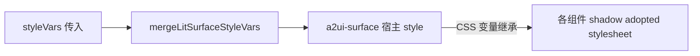

# styleVars 与主题说明

本文说明 `BaseRenderer` / `LitSurfaceHost` 的 **`styleVars`**、**`className`** 与 **`injectAntdStylesInShadow`** 在协议 **0.8** 与 **v0.9** 下的生效方式。

实现以源码为准：

- `defaultA2uiLitStyleVars.ts` — 默认官方 token
- `a2uiThemePresets.ts` — 内置 `themePreset` 预设表
- `litStyleVars.ts` — `mergeLitSurfaceStyleVars`、历史键桥接
- `LitSurfaceHost.tsx` — 写入 DOM、Lit 渲染
- `index.less` — 解析失败面板（非 Lit）

**v0.9**：不再向各组件 shadow 注入业务 `*.css`；外观由 basic catalog 的 **adopted stylesheet + `styleVars` 继承的 `--a2ui-*`** 决定。

**v0.8**：组件通过 **`theme.components.*` 工具类 classMap**（见 `defaultA2uiV08Theme.js`）+ `structuralStyles` 着色；`styleVars` 主要影响 **`beginRendering.styles.primaryColor` → `--p-*` 调色板** 及宿主上的 `p-50` 等，**不能**替代完整 theme。

---

## 1 注入方式与 API

| 项目 | 说明 |
|---|---|
| **写入位置** | `mergeLitSurfaceStyleVars` 结果写入 **`.a2ui-renderer-container`** 与 **`<a2ui-surface>` 宿主** 的 `style`。自定义属性可穿透 Shadow 边界，供子组件 shadow 内 `var()` 解析。 |
| **key 写法** | `a2ui-foo` 或 `--a2ui-foo`，内部统一为不带 `--` 的键名。 |
| **默认值** | `DEFAULT_A2UI_LIT_STYLE_VARS`（与 v0.9 basic catalog 对齐的官方名）。 |
| **内置预设** | `themePreset`：`default` \| `conversation` \| `cyber` \| `platformInterconnect` \| `deepBlueWisdom`，见 `a2uiThemePresets.ts`。 |
| **预设 CSS** | 预设可带 `shadowCss`，经 `themePresetShadowSheet` 注入各组件 ShadowRoot；业务可用 `themePresetCss` 追加。 |
| **合并函数** | `mergeLitSurfaceStyleVars(styleVars?, protocolVersion, themePreset?)`，优先级 DEFAULT &lt; preset.styleVars &lt; styleVars。 |
| **主色同步** | 设置 `a2ui-color-primary` 时额外写入 `p-50`，兼容少量历史 `var(--p-50)` 回退。 |
| **className** | 挂在渲染根容器，用于业务 Less；**不能**穿透 Lit 组件 shadow 改内部结构样式。 |
| **antd in shadow** | `injectAntdStylesInShadow={true}` 时，仅在**该层** Shadow 的 DOM 上出现 **`ant-` / `anticon` 类名**时挂载 **antd.min.css**；不扫描子组件 shadow，避免 surface 误注入（与主题变量无关）。 |

### 1.1 推荐用法

**仅换一套内置风格**（对话流表单，圆角与间距已调好）：

```tsx
<BaseRenderer
  protocolVersion="0.9"
  messages={messages}
  themePreset="conversation"
  onAction={handleAction}
/>
```

**预设 + 少量覆盖**：

```tsx
import {
  BaseRenderer,
  DEFAULT_A2UI_LIT_STYLE_VARS,
} from '@boteteam/a2ui-render';

<BaseRenderer
  protocolVersion="0.9"
  messages={messages}
  themePreset="conversation"
  styleVars={{
    'a2ui-color-primary': '#722ed1',
    'a2ui-button-border-radius': '20px',
  }}
  onAction={handleAction}
/>
```

**完全自定义**（与改前一致）：

```tsx
<BaseRenderer
  protocolVersion="0.9"
  messages={messages}
  styleVars={{
    ...DEFAULT_A2UI_LIT_STYLE_VARS,
    'a2ui-color-primary': '#1677ff',
    'a2ui-color-on-primary': '#ffffff',
    'a2ui-button-border-radius': '20px',
  }}
  onAction={handleAction}
/>
```

### 1.2 内置 themePreset

| 预设 | 场景 | 要点 |
|---|---|---|
| `default` | 通用，与 `DEFAULT_A2UI_LIT_STYLE_VARS` 相同 | 不传 `themePreset` 时等同此值 |
| `conversation` | 聊天气泡内 A2UI 表单 | 浅灰底、12px 圆角、20px pill 主按钮、略大内边距 |
| `compact` | 侧栏、仪表盘窄区 | 6px 圆角、更小字号与间距 |
| `dark` | 深色宿主 | 深灰表面、主色 `#4096ff`、解析错误面板同步暗色 |
| `cyber` | 炫彩科技演示 | 对齐 beijing-travel-cyber.pen：深紫渐变底、玻璃卡片、Chip 选中态、渐变 CTA |
| `platformInterconnect` | 平台互联演示 | 对齐 beijing-travel-platform-interconnect.pen：浅紫蓝底、白卡片、蓝绿 CTA |
| `deepBlueWisdom` | 深蓝智慧演示 | 对齐 beijing-travel-deep-blue-wisdom.pen：深蓝底、白卡片、蓝紫渐变 CTA |

完整定义见 `A2UI_THEME_PRESET_DEFINITIONS`（含 `styleVars`、`shadowCss`、`containerClass`）。

### 1.3 预设 shadowCss 与 themePresetCss

变量只能覆盖 adopted stylesheet 里已暴露的 token；渐变、动画、多状态组合等需 **shadowCss**：

```tsx
<BaseRenderer
  protocolVersion="0.9"
  themePreset="cyber"
  onAction={handleAction}
/>

// 在预设 CSS 之后追加
<BaseRenderer
  themePreset="conversation"
  themePresetCss={`
    .a2ui-button.a2ui-button-primary {
      letter-spacing: 0.04em;
    }
  `}
/>
```

新增内置主题：在 `a2uiThemePresets.ts` 增加预设项，长 CSS 可放到 `themePresets/*.shadow.css.ts`；可选 `containerClass` 并在 `index.less` 写 Light DOM 样式。

也可用 `resolveA2UIThemePresetStyleVars('conversation')` 在业务侧手动合并变量。

---

## 2 主题如何作用到 Lit 组件



- **能改的**：adopted stylesheet 里写成 `var(--a2ui-xxx, 默认值)` 的 token（颜色、间距、字号、圆角等）。
- **不能改的**：写死在 stylesheet 里的属性（如 `display: inline-flex`），除非上游提供对应变量。
- **不要依赖**：组件内部变量 `--_a2ui-*`、`--_color-primary` 等，优先改其引用的公开 `--a2ui-*`。

---

## 3 DEFAULT_A2UI_LIT_STYLE_VARS 一览

以下为当前默认表中的键（官方名）。完整默认值见 `defaultA2uiLitStyleVars.ts`。

### 3.1 语义色与边框

| 变量 | 典型用途 |
|---|---|
| `a2ui-color-background` / `a2ui-color-on-background` | 页面底与前景 |
| `a2ui-color-surface` / `a2ui-color-on-surface` | 卡片、默认按钮底 |
| `a2ui-color-primary` / `a2ui-color-on-primary` | 主色按钮、强调 |
| `a2ui-color-secondary` / `a2ui-color-on-secondary` | 次要表面 |
| `a2ui-color-border` | 边框色 |
| `a2ui-color-input` / `a2ui-color-on-input` | 输入框底与字色 |
| `a2ui-border-radius` | 全局圆角回退 |
| `a2ui-border-width` | 边框宽度 |

### 3.2 字号阶梯（v0.9 Text）

| 变量 | 映射 |
|---|---|
| `a2ui-font-size-2xl` | h1 |
| `a2ui-font-size-xl` | h2 |
| `a2ui-font-size-l` | h3 |
| `a2ui-font-size-m` | p、h4 |
| `a2ui-font-size-s` | h5 |
| `a2ui-font-size-xs` | caption |

### 3.3 间距与布局

| 变量 | 典型用途 |
|---|---|
| `a2ui-grid-base` / `a2ui-spacing-m` | 间距阶梯基准 |
| `a2ui-row-gap` | Row |
| `a2ui-column-gap` | Column |

### 3.4 组件 token

| 组件 | 默认表中相关键 |
|---|---|
| Button | `a2ui-button-background`、`a2ui-button-padding`、`a2ui-button-border-radius`、`a2ui-button-margin` |
| TextField | `a2ui-textfield-padding`、`a2ui-textfield-border-radius`、`a2ui-textfield-color-border-focus`、`a2ui-label-font-size` |
| Card | `a2ui-card-background`、`a2ui-card-padding`、`a2ui-card-border-radius` |
| Checkbox | `a2ui-checkbox-gap`、`a2ui-checkbox-size` |
| Slider | `a2ui-slider-thumb-color`、`a2ui-slider-track-color` |

**Button 变体说明**：

- **primary**：背景 `a2ui-color-primary`，文字 `a2ui-color-on-primary`。
- **default**：背景多为 `a2ui-button-background` 或 `a2ui-color-surface`。

### 3.5 解析失败面板（本包 UI）

| 变量 | 说明 |
|---|---|
| `a2ui-parse-error-border` / `bg` / `text` / `title` / `link` | 错误面板 |
| `a2ui-parse-error-pre-bg` / `pre-text` | 详情 `<pre>` |

由 `index.less` 中 `.a2ui-parse-error*` 消费，**不经过 Lit**。

---

## 4 按组件：官方可读 token 参考（v0.9）

下列为 `@a2ui/lit` basic catalog 中常见、可通过 `styleVars` 继承覆盖的变量（不限于 DEFAULT 默认表）。未列出的组件同样可能支持其它 `--a2ui-*`，以 DevTools 中 adopted stylesheet 为准。

### 4.1 Text

**tag**：`a2ui-basic-text`（0.8 多为 `a2ui-text`）

| 变量 | 说明 |
|---|---|
| `a2ui-font-size-2xl` ~ `a2ui-font-size-xs` | 标题与正文阶梯 |
| `a2ui-color-on-background` | 正文色 |
| `a2ui-text-caption-color` | 说明文字 |
| `a2ui-line-height-headings` / `a2ui-line-height-body` | 行高 |

### 4.2 Row / Column

| 变量 | 说明 |
|---|---|
| `a2ui-row-gap` | Row 子项间距 |
| `a2ui-column-gap` | Column 子项间距 |

### 4.3 Card

**tag**：`a2ui-card`

| 变量 | 说明 |
|---|---|
| `a2ui-card-background` | 背景 |
| `a2ui-card-padding` | 内边距 |
| `a2ui-card-border-radius` | 圆角 |
| `a2ui-card-border` | 边框简写，常回退 `a2ui-color-border` |
| `a2ui-card-box-shadow` | 阴影 |

### 4.4 Button

**tag**：`a2ui-basic-button`

| 变量 | 说明 |
|---|---|
| `a2ui-color-primary` / `a2ui-color-on-primary` | primary 变体 |
| `a2ui-button-background` | default 背景 |
| `a2ui-button-padding` | 内边距 |
| `a2ui-button-border-radius` | 圆角 |
| `a2ui-button-border` | 边框 |
| `a2ui-color-primary-hover` / `a2ui-color-secondary-hover` | 悬停 |

### 4.5 TextField

**tag**：`a2ui-basic-textfield`

| 变量 | 说明 |
|---|---|
| `a2ui-color-input` / `a2ui-color-on-input` | 输入区底与字色 |
| `a2ui-textfield-padding` | 内边距 |
| `a2ui-textfield-border-radius` | 圆角 |
| `a2ui-textfield-color-border-focus` | 聚焦边框色 |
| `a2ui-textfield-border` | 边框，常回退 `a2ui-border` |
| `a2ui-label-font-size` | 标签字号 |

### 4.6 Checkbox / Slider

| 变量 | 说明 |
|---|---|
| `a2ui-checkbox-gap` / `a2ui-checkbox-size` | 复选框 |
| `a2ui-slider-thumb-color` / `a2ui-slider-track-color` | 滑块 |

### 4.7 ChoicePicker

**tag**：`a2ui-choicepicker`

使用 `a2ui-choicepicker-*` 系列（如 `gap`、`chip-padding`、`chip-border-radius` 等），**不是**旧名 `a2ui-choice-selected-*`。

### 4.8 其它内置类型

**List、Image、Icon、Divider、Tabs、Modal** 等由官方 stylesheet 自带 token 驱动；在 `styleVars` 中设置同名 `--a2ui-*` 即可尝试覆盖，DEFAULT 未逐一列出。

---

## 5 历史业务键桥接（向后兼容）

若仍传入旧键名，`mergeLitSurfaceStyleVars` 会在**官方键未显式传入**时自动补全。完整映射表见源码 **`A2UI_OFFICIAL_FROM_LEGACY_STYLE_VARS`**。

| 历史键（legacy） | 桥接到官方键 |
|---|---|
| `a2ui-radius` | `a2ui-border-radius`、`a2ui-button-border-radius`、`a2ui-textfield-border-radius` 等 |
| `a2ui-button-bg` | `a2ui-button-background` |
| `a2ui-input-bg` | `a2ui-color-input` |
| `a2ui-input-text-color` | `a2ui-color-on-input` |
| `a2ui-input-padding` | `a2ui-textfield-padding` |
| `a2ui-input-focus-border-color` | `a2ui-textfield-color-border-focus` |
| `a2ui-card-bg` | `a2ui-card-background` |
| `a2ui-card-radius` | `a2ui-card-border-radius` |
| `a2ui-inline-gap` | `a2ui-row-gap` |
| `a2ui-form-item-gap` | `a2ui-column-gap` |
| `a2ui-slider-accent-color` | `a2ui-slider-thumb-color` |
| `a2ui-button-text-color` | `a2ui-color-on-primary` |

### 5.1 v0.9 字号旧名

仅 **protocolVersion === '0.9'** 时：

| 历史键 | 桥接到 |
|---|---|
| `a2ui-text-h1-size` | `a2ui-font-size-2xl` |
| `a2ui-text-h2-size` | `a2ui-font-size-xl` |
| `a2ui-text-h3-size` | `a2ui-font-size-l` |
| `a2ui-text-body-size` | `a2ui-font-size-m` |
| `a2ui-text-h5-size` | `a2ui-font-size-s` |
| `a2ui-text-caption-size` | `a2ui-font-size-xs` |

### 5.2 已废弃、无桥接的键

下列键**不会**影响 Lit 外观（传入后仅存在于 DOM style 上）。清单见 **`DEPRECATED_A2UI_STYLE_VAR_KEYS`**，请改用第 3、4 节官方名。

示例：`a2ui-button-height`、`a2ui-input-height`、`a2ui-choice-selected-bg`、`a2ui-color-success`、`a2ui-text-heading-color` 等。

---

## 6 协议 0.8 与 v0.9 差异

| 项目 | v0.9 | 0.8 |
|---|---|---|
| 组件 tag | 多为 `a2ui-basic-*` | 多为 `a2ui-*` |
| 推荐 styleVars 键 | **官方** `a2ui-font-size-*`、`a2ui-color-on-*` 等 | 同左；字号旧名桥接**不启用** |
| 主题机制 | surface 宿主 `--a2ui-*` → adopted sheet | **`DEFAULT_A2UI_V08_THEME` classMap** + `structuralStyles`；`primaryColor` 生成 `--p-*` |
| 默认 DEFAULT | `DEFAULT_A2UI_LIT_STYLE_VARS`（v0.9 token） | v0.9 token 对 0.8 组件**基本无效**；0.8 样式靠 `DEFAULT_A2UI_V08_THEME` |

**建议**：新接入统一使用 **`protocolVersion="0.9"`** 与第 3 节官方键名。

---

## 7 与 README 的关系

`README.md` 说明如何挂载 `BaseRenderer` 与远程组件；**主题变量契约、默认表、桥接与按组件 token 以本文为准**。变更 `defaultA2uiLitStyleVars.ts` 或 `litStyleVars.ts` 时请同步更新本文。
